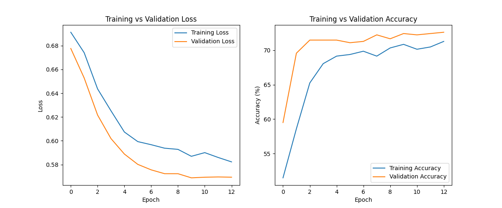

Autor: Jorge Martinez, 100508957@alumnos.uc3m.es

Fecha: April 28, 2024

# Informe del Proyecto de March Machine Learning Mania 2024

## Resumen

Este proyecto enfrenta el reto de desarrollar un modelo predictivo avanzado que pueda estimar con precisión los resultados de los partidos del torneo de baloncesto de la NCAA, también conocido como March Madnes, en el marco de la competencia de Kaggle "March Machine Learning Mania 2024". Mediante un análisis comparativo de diversas técnicas de aprendizaje automático, se identifican los modelos que demuestran ser más prometedores en términos de precisión y confiabilidad. En particular, se implementan y evalúan modelos avanzados basados en árboles de decisión, como XGBoost, así como modelos de redes neuronales profundas, para determinar cuál ofrece un mejor desempeño predictivo.

La preparación de los datos es fundamental para el éxito de los modelos. Este proceso incluye una meticulosa limpieza, una cuidadosa selección y una transformación estratégica de características para maximizar la eficiencia de los modelos predictivos. Además, se aplican técnicas de validación cruzada para asegurar la robustez de los modelos.

El informe detalla exhaustivamente el proceso de selección de los modelos, incluyendo una justificación completa de las decisiones tomadas en cada etapa, desde la preparación inicial de los datos hasta la evaluación final de los modelos. Los resultados obtenidos no solo confirman la eficacia de los modelos seleccionados, sino que también incluyen una simulación detallada del torneo March Madness 2024, permitiendo un análisis profundo del comportamiento del modelo en condiciones de torneo real.

## Fuente de Datos

Este proyecto utiliza datos de la competición March Machine Learning Mania 2024, disponible en Kaggle. La competición proporciona un conjunto de datos tabulares que incluye resultados históricos de juegos y estadísticas de equipos participantes en el torneo de baloncesto de la NCAA.

Enlace al dataset: [March Machine Learning Mania 2024 Dataset](https://www.kaggle.com/c/march-machine-learning-mania-2024)

De todos los datos disponibles se van a usar los siguientes:

### MTeams.csv

Este archivo identifica los diferentes equipos universitarios presentes en el conjunto de datos.

#### Descripción de las columnas:

| Columna        | Descripción |
| -------------- | ----------- |
| **TeamID**     | Un número de identificación de 4 dígitos, que identifica de forma exclusiva a cada equipo de la NCAA. |
| **TeamName**   | Nombre de la universidad del equipo. |
| **FirstD1Season** | La primera temporada en nuestro conjunto de datos en que la escuela era de División I. |
| **LastD1Season**  | La última temporada de nuestro conjunto de datos en la que la escuela era de División I. |

### MNCAATourneySeeds.csv

Este archivo identifica las posiciones de todos los equipos en cada torneo de la NCAA®, para todas las temporadas de datos históricos. Por lo tanto, hay entre 64 y 68 filas para cada año, dependiendo de si hubo partidos de desempate y de cuántos hubo.

#### Descripción de las columnas:

| Columna | Descripción |
|---------|-------------|
| **Season** | El año en que se jugó el torneo. |
| **Seed** | Se trata de un identificador de 3/4 caracteres de la posicion, donde el primer carácter es W, X, Y o Z (que identifica la región en la que estaba el equipo) y los dos dígitos siguientes (01, 02, ..., 15 o 16) indican la clasificacion dentro de la región. |
| **TeamID** | Identifica el número de identificación del equipo. |

### MRegularSeasonDetailedResults.csv

Este archivo proporciona los resultados de los equipos de muchas temporadas regulares de datos históricos, a partir de la temporada 2003.

Contiene una linea de datos para cada partido de la temporada regular, con las estadisticas detalladas del encuentro.

Se muestran las 5 primeras filas de estos para que se pueda ver el tipo de informacion que continen:

| Season | DayNum | WTeamID | WScore | LTeamID | LScore | WLoc | NumOT | WFGM | WFGA | ... | LAst | LTO | LStl | LBlk | LPF |
|--------|--------|---------|--------|---------|--------|------|-------|------|------|-----|------|-----|------|------|-----|
| 2003   | 10     | 1104    | 68     | 1328    | 62     | N    | 0     | 27   | 58   | ... | 8    | 18  | 9    | 2    | 20  |
| 2003   | 10     | 1272    | 70     | 1393    | 63     | N    | 0     | 26   | 62   | ... | 7    | 12  | 8    | 6    | 16  |
| 2003   | 11     | 1266    | 73     | 1437    | 61     | N    | 0     | 24   | 58   | ... | 9    | 12  | 2    | 5    | 23  |
| 2003   | 11     | 1296    | 56     | 1457    | 50     | N    | 0     | 18   | 38   | ... | 9    | 19  | 4    | 3    | 23  |
| 2003   | 11     | 1400    | 77     | 1208    | 71     | N    | 0     | 30   | 61   | ... | 12   | 10  | 7    | 1    | 14  |

### MNCAATourneyDetailedResults.csv

Este archivo proporciona los resultados y estadisticas de los equipos en muchos torneos de la NCAA®, a partir de la temporada 2003. 

Al igual que el anterior archivo, contiene una linea de datos para cada partido, con las estadisticas detalladas del encuentro.

Se muestran las 5 primeras filas de estos para que se pueda ver el tipo de informacion que continen:

| Season | DayNum | WTeamID | WScore | LTeamID | LScore | WLoc | NumOT | WFGM | WFGA | WFGM3 | WFGA3 | WFTM | ... | LFGM | LFGA | LFGM3 | LFGA3 | LFTM | LFTA | LOR | LDR | LAst | LTO | LStl | LBlk | LPF |
|--------|--------|---------|--------|---------|--------|------|-------|------|------|-------|-------|------|-----|------|------|-------|-------|------|------|-----|-----|------|-----|------|------|-----|
| 2003   | 134    | 1421    | 92     | 1411    | 84     | N    | 1     | 32   | 69   | 11    | 29    | 17   | ... | 29   | 67   | 12    | 31    | 14   | 31   | 17  | 28  | 16   | 15  | 5    | 0    | 22  |
| 2003   | 136    | 1112    | 80     | 1436    | 51     | N    | 0     | 31   | 66   | 7     | 23    | 11   | ... | 20   | 64   | 4     | 16    | 7    | 7    | 8   | 26  | 12   | 17  | 10   | 3    | 15  |
| 2003   | 136    | 1113    | 84     | 1272    | 71     | N    | 0     | 31   | 59   | 6     | 14    | 16   | ... | 25   | 69   | 7     | 28    | 14   | 21   | 20  | 22  | 11   | 12  | 2    | 5    | 18  |
| 2003   | 136    | 1141    | 79     | 1166    | 73     | N    | 0     | 29   | 53   | 3     | 7     | 18   | ... | 27   | 60   | 7     | 17    | 12   | 17   | 14  | 17  | 20   | 21  | 6    | 6    | 21  |
| 2003   | 136    | 1143    | 76     | 1301    | 74     | N    | 1     | 27   | 64   | 7     | 20    | 15   | ... | 25   | 56   | 9     | 21    | 15   | 20   | 10  | 26  | 16   | 14  | 5    | 8    | 19  |

### 2024_tourney_seeds.csv

Contiene el cuadro de playoffs de este March Madness 2024

## Objetivo del Proyecto

El propósito principal de este proyecto es desarrollar un modelo predictivo avanzado para los partidos del torneo March Madness 2024 de la NCAA. Este modelo no solo buscará predecir con alta precisión los ganadores de cada partido, sino que también calculará la probabilidad de victoria para cada equipo. Este enfoque dual permitirá estimar los resultados de manera más completa y detallada.

El objetivo final es competir y destacar en la competencia de Kaggle "March Machine Learning Mania 2024", diseñando un bracket que maximice la precisión en las predicciones. Este bracket se completa siguiendo el formato típico del torneo, como se muestra en la imagen a continuación:

## Exploración de los Datos e Información Relevante

El dataset proporcionado para este proyecto incluye una variedad de variables, como el historial de partidos, rankings de equipos y estadísticas de rendimiento. Se aplicarán diversas transformaciones a estos datos para optimizar su estructura, facilitando así una mejor adaptación a los modelos predictivos. Este proceso de transformación tiene como objetivo alinear los datos con las necesidades analíticas específicas del modelo, mejorando la capacidad del mismo para realizar predicciones precisas y efectivas.

### Preparacion de los datos

El proceso de preparación de los datos comienza con los archivos MRegularSeasonDetailedResults.csv y MNCAATourneyDetailedResults.csv. Se realiza una transformación importante en la estructura de estos datos: cambiar la nomenclatura de ganador (W) y perdedor (L) a equipo 1 (T1) y equipo 2 (T2). Esto implica duplicar el número de filas original, ya que para cada partido se consideran dos casos: uno donde el ganador es el equipo 1 y otro donde es el equipo 2.

Esta transformación se aplica tanto a los datos de la temporada regular como a los de los playoffs, resultando en una estructura de datos mejorada para análisis predictivo:

| Season | DayNum | T1_TeamID | T1_Score | T2_TeamID | T2_Score | location | NumOT | T1_FGM | T1_FGA | ... | T2_FTM | T2_FTA | T2_OR | T2_DR | T2_Ast | T2_TO | T2_Stl | T2_Blk | T2_PF | PointDiff |
|--------|--------|-----------|----------|-----------|----------|----------|-------|--------|--------|-----|--------|--------|-------|-------|--------|-------|--------|-------|-------|-----------|
| 2003   | 10     | 1104      | 68       | 1328      | 62       | 0        | 0     | 27     | 58     | ... | 16     | 22     | 10    | 22   | 8      | 18    | 9      | 2     | 20    | 6         |
| 2003   | 10     | 1328      | 62       | 1104      | 68       | 0        | 0     | 22     | 53     | ... | 11     | 18     | 14    | 24   | 13     | 23    | 7      | 1     | 22    | -6        |
| 2003   | 10     | 1272      | 70       | 1393      | 63       | 0        | 0     | 26     | 62     | ... | 9      | 20     | 20    | 25   | 7      | 12    | 8      | 6     | 16    | 7         |
| 2003   | 10     | 1393      | 63       | 1272      | 70       | 0        | 0     | 24     | 67     | ... | 10     | 19     | 15    | 28   | 16     | 13    | 4      | 4     | 18    | -7        |
| 2003   | 11     | 1266      | 73       | 1437      | 61       | 0        | 0     | 24     | 58     | ... | 14     | 23     | 31    | 22   | 9      | 12    | 2      | 5     | 23    | 12        |

### Creación de atributos

Partiendo de los datos modificados de temporada regular y playoffs, y considerando los seeds de los equipos en los distintos años, se llevan a cabo varias operaciones para enriquecer el dataset:

#### 1. Agregación de estadísticas de temporada regular por equipo y temporada

Se calcula el promedio de cada equipo de cada temporada de métricas clave como tiros de campo, rebotes y asistencias para cada equipo y temporada.

#### 2. Duplicación de estadísticas para equipos 1 y 2

Para facilitar las fusiones de datos futuras, se duplican las estadísticas agregadas, creando dos conjuntos de columnas: uno para el "equipo 1" y otro para el "equipo 2". Esto permite asociar cada partido del torneo con un conjunto completo de estadísticas para ambos equipos involucrados.

#### 3. Fusión de estadísticas de temporada con datos del torneo

Las estadísticas de la temporada regular se fusionan con los datos de los partidos del torneo. Esta fusión se realiza para ambos equipos en cada partido, enriqueciendo los registros con un contexto histórico amplio que es crucial para el análisis predictivo.

Se fusiona las columnas, *Season*, *DayNum*, *T1_TeamID*, *T1_Score*, *T2_TeamID*, *T2_Score*, de cada partido de playoffs, con las correspondientes estadisticas calculadas anteriormente.

#### 4. Inclusión de la posicion en la clasificación

Se añade la diferencia de posicion entre los dos equipos en cada partido del torneo. La posicion refleja los resultados en la temporada regular, por lo tanto, la valoración y expectativas de los equipos, y su diferencia es un indicador significativo que puede influir en las predicciones del resultado del partido.

#### 5. Porcentaje de victorias en los ultimas dos semanas de temporada regular

Este indicador, aunque no siempre utilizado, puede proporcionar insights adicionales sobre la forma reciente de los equipos.

#### Forma final de los datos

Los datos finales enriquecidos proporcionan una base sólida para la construcción de un modelo predictivo robusto y preciso para los partidos de la NCAA.

Obteniendo esto como resultado:

| Season | DayNum | T1_TeamID | T1_Score | T2_TeamID | T2_Score | T1_FGM  | ... | T2_opponent_Stl | T2_opponent_Blk | T2_opponent_PF | T2_PointDiff | T1_seed | T2_seed | Seed_diff |
|--------|--------|-----------|----------|-----------|----------|---------|-----|-----------------|-----------------|----------------|--------------|---------|---------|-----------|
| 2003   | 134    | 1421      | 92       | 1411      | 84       | 24.38   | ... | 8.00            | 2.60            | 21.63          | 1.97         | 16      | 16      | 0         |
| 2003   | 134    | 1411      | 84       | 1421      | 92       | 24.73   | ... | 8.83            | 4.24            | 18.69          | -7.24        | 16      | 16      | 0         |
| 2003   | 136    | 1436      | 51       | 1112      | 80       | 24.83   | ... | 5.96            | 2.39            | 22.07          | 14.96        | 16      | 1       | 15        |
| 2003   | 136    | 1112      | 80       | 1436      | 51       | 30.32   | ... | 7.10            | 3.66            | 17.93          | 4.66         | 1       | 16      | -15       |
| 2003   | 136    | 1113      | 84       | 1272      | 71       | 27.21   | ... | 7.28            | 3.17            | 19.93          | 8.69         | 10      | 7       | 3         |
| 2023   | 152    | 1163      | 72       | 1274      | 59       | 27.61   | ... | 5.97            | 3.28            | 15.06          | 7.28         | 4       | 5       | -1        |
| 2023   | 152    | 1194      | 71       | 1361      | 72       | 27.91   | ... | 6.31            | 2.94            | 18.22          | 7.53         | 9       | 5       | 4         |
| 2023   | 152    | 1361      | 72       | 1194      | 71       | 25.09   | ... | 5.62            | 2.41            | 16.75          | 12.88        | 5       | 9       | -4        |
| 2023   | 154    | 1163      | 76       | 1361      | 59       | 27.61   | ... | 6.31            | 2.94            | 18.22          | 7.53         | 4       | 5       | -1        |
| 2023   | 154    | 1361      | 59       | 1163      | 76       | 25.09   | ... | 6.67            | 2.88            | 17.36          | 13.42        | 5       | 4       | 1         |

2630 filas

63 columnas

**Nombre de las columnas**

- `Season`
- `DayNum`
- `T1_TeamID`
- `T1_Score`
- `T2_TeamID`
- `T2_Score`
- `T1_FGM`
- `T1_FGA`
- `T1_FGM3`
- `T1_FGA3`
- `T1_FTM`
- `T1_FTA`
- `T1_OR`
- `T1_DR`
- `T1_Ast`
- `T1_TO`
- `T1_Stl`
- `T1_Blk`
- `T1_PF`
- `T1_opponent_FGM`
- `T1_opponent_FGA`
- `T1_opponent_FGM3`
- `T1_opponent_FGA3`
- `T1_opponent_FTM`
- `T1_opponent_FTA`
- `T1_opponent_OR`
- `T1_opponent_DR`
- `T1_opponent_Ast`
- `T1_opponent_TO`
- `T1_opponent_Stl`
- `T1_opponent_Blk`
- `T1_opponent_PF`
- `T1_PointDiff`
- `T2_FGM`
- `T2_FGA`
- `T2_FGM3`
- `T2_FGA3`
- `T2_FTM`
- `T2_FTA`
- `T2_OR`
- `T2_DR`
- `T2_Ast`
- `T2_TO`
- `T2_Stl`
- `T2_Blk`
- `T2_PF`
- `T2_opponent_FGM`
- `T2_opponent_FGA`
- `T2_opponent_FGM3`
- `T2_opponent_FGA3`
- `T2_opponent_FTM`
- `T2_opponent_FTA`
- `T2_opponent_OR`
- `T2_opponent_DR`
- `T2_opponent_Ast`
- `T2_opponent_TO`
- `T2_opponent_Stl`
- `T2_opponent_Blk`
- `T2_opponent_PF`
- `T2_PointDiff`
- `T1_seed`
- `T2_seed`
- `Seed_diff`

## Modelos de Machine Learning y Experimentación

Durante la fase de experimentación, exploramos dos principales modelos de aprendizaje automático: redes neuronales y XGBoost. Ambos modelos fueron evaluados con la intención de maximizar la precisión y confiabilidad en las predicciones del torneo NCAA.

### XGBoost

Utilizamos XGBoost (Extreme Gradient Boosting) por su reconocida eficiencia en competencias de datos y su habilidad para manejar variados tipos de características. Configuramos XGBoost para minimizar el error absoluto medio (MAE), utilizando una función de pérdida personalizada basada en la distribución de Cauchy, lo que ayudó a mejorar la robustez del modelo frente a valores atípicos. El ajuste fino del modelo se realizó mediante una validación cruzada repetida para garantizar su capacidad de generalización y estabilidad.

#### **Inicialización y Configuración de Datos**

Partiendo de los datos preprocesados explicados anteriormente se aplica lo siguiente:

- **Cálculo de la Variable Objetivo:** La diferencia de puntuación entre los equipos (`T1_Score` - `T2_Score`) se establece como la variable objetivo `y`. Esta representación directamente relacionada con el resultado del partido facilita un enfoque de modelado orientado al objetivo real.

| Index | Target |
|-------|--------|
| 0     | 8      |
| 1     | -8     |
| 2     | -29    |
| 3     | 29     |
| 4     | 13     |

- **Selección de Características:** Las características utilizadas para el entrenamiento se extraen del DataFrame, excluyendo las primeras seis columnas que no son relevantes para el modelo. Esto asegura que solo se utilicen datos pertinentes que potencialmente influyan en el resultado del partido.
- `Season`
- `DayNum`
- `T1_TeamID`
- `T1_Score`
- `T2_TeamID`
- `T2_Score`

|    | T1_FGM    | T1_FGA    | T1_FGM3   | T1_FGA3   | T1_FTM    | T1_FTA    | T1_OR     | ... | T2_opponent_Stl | T2_opponent_Blk | T2_opponent_PF | T2_PointDiff | T1_seed | T2_seed | Seed_diff |
|----|-----------|-----------|-----------|-----------|-----------|-----------|-----------|-----|-----------------|-----------------|----------------|--------------|---------|---------|-----------|
| 0  | 24.379310 | 56.793103 | 6.482759  | 18.000000 | 15.965517 | 20.931034 | 12.275862 | ... | 8.000000        | 2.600000        | 21.633333      | 1.966667     | 16      | 16      | 0         |
| 1  | 24.733333 | 55.266667 | 5.933333  | 18.500000 | 17.400000 | 28.066667 | 13.166667 | ... | 8.827586        | 4.241379        | 18.689655      | -7.241379    | 16      | 16      | 0         |
| 2  | 24.827586 | 55.862069 | 5.275862  | 15.482759 | 12.862069 | 19.551724 | 12.965517 | ... | 5.964286        | 2.392857        | 22.071429      | 14.964286    | 16      | 1       | 15        |
| 3  | 30.321429 | 65.714286 | 7.035714  | 20.071429 | 17.535714 | 25.000000 | 15.178571 | ... | 7.103448        | 3.655172        | 17.931034      | 4.655172     | 1       | 16      | -15       |
| 4  | 27.206897 | 56.896552 | 4.000000  | 12.586207 | 17.551724 | 26.206897 | 13.689655 | ... | 7.275862        | 3.172414        | 19.931034      | 8.689655     | 10      | 7       | 3         |

#### **Configuración de Parámetros del Modelo**
El modelo se configura con parámetros específicos que controlan su comportamiento durante el entrenamiento:

**Métrica de Evaluación:** Se utiliza el error absoluto medio (`mae`), que proporciona una medida robusta del error que penaliza igualmente todos los errores, independientemente de su magnitud.

**Hiperparámetros:** Se ajustan varios hiperparámetros para optimizar el desempeño del modelo.

- **`eval_metric`: 'mae'**
  - **Descripción:** Esta es la métrica de evaluación utilizada para validar los datos mientras el modelo se entrena. 'MAE' significa Error Absoluto Medio, una métrica que proporciona una medida promedio de las diferencias absolutas entre las predicciones y los valores observados, dando igual peso a todos los errores.
  
- **`booster`: 'gbtree'**
  - **Descripción:** Especifica el tipo de modelo que se utilizará. 'gbtree' indica que se usarán árboles de decisión potenciados como base del modelo. Este es el tipo de refuerzo más común y generalmente el más efectivo para problemas estructurados/tabulares.

- **`eta`: 0.05**
  - **Descripción:** También conocida como la tasa de aprendizaje, controla la velocidad a la que el modelo se adapta a las complejidades del problema. Un valor más bajo hace que el entrenamiento sea más lento, pero puede mejorar la precisión del modelo y prevenir el sobreajuste.

- **`subsample`: 0.35**
  - **Descripción:** Es la fracción de observaciones a ser seleccionadas aleatoriamente para cada árbol. Submuestrear ayuda a prevenir el sobreajuste y añade más aleatoriedad al proceso de entrenamiento.
  
- **`colsample_bytree`: 0.7**
  - **Descripción:** Es la fracción de columnas a ser seleccionadas aleatoriamente para cada árbol. Al igual que `subsample`, este parámetro ayuda a controlar el sobreajuste, asegurando que cada árbol se construya con una muestra aleatoria de las características.

- **`num_parallel_tree`: 3**
  - **Descripción:** Este parámetro especifica el número de árboles que se construirán en paralelo en cada iteración del boosting. Usar más de un árbol por iteración es una forma de potenciar el ensamblaje, similar al bagging.

- **`min_child_weight`: 40**
  - **Descripción:** Define el peso mínimo necesario en las hojas para continuar haciendo una partición en el árbol. Un valor más alto reduce el sobreajuste al hacer que el modelo sea más conservador, requiriendo más evidencia antes de decidir hacer una división.

- **`gamma`: 10**
  - **Descripción:** Especifica el mínimo descenso en la función de pérdida requerido para hacer una partición adicional en un nodo del árbol. Un valor mayor hace que el modelo sea más conservador, evitando particiones que resultan en ganancias mínimas en el rendimiento.

- **`max_depth`: 3**
  - **Descripción:** Define la profundidad máxima de cada árbol. Limitar la profundidad del árbol ayuda a prevenir el sobreajuste, asegurando que los árboles no sean demasiado complejos y especializados en los datos de entrenamiento.

- **`verbosity`: 0**
  - **Descripción:** Controla el nivel de salida que el modelo produce mientras se entrena. Un valor de '0' significa silencio; es decir, no se imprimirán mensajes durante el entrenamiento, lo cual es útil para mantener los registros de entrenamiento limpios y enfocados en la información más crítica.

Estos parámetros están diseñados para equilibrar la precisión, la eficiencia computacional y la prevención del sobreajuste, adaptando el modelo a las particularidades de los datos y el problema específico de predicción de partidos de la NCAA.

#### **Entrenamiento y Evaluación del Modelo**

Se siguen los siguientes pasos para crear el modelo

- **Función de Objetivo de Cauchy:** Implementa una función de pérdida personalizada basada en la distribución de Cauchy para mejorar la robustez del modelo frente a valores atípicos, lo cual es común en datos deportivos.

- **Validación Cruzada:** Se ha entrenando el modelo en cada pliegue y luego validándolo en el pliegue restante. La validación cruzada ayuda a entender cómo se desempeñaría el modelo en general. Y es esencial para ajustar los hiperparámetros del modelo. De esta fase sacamos el valor de iteration_counts.

Repeat CV result:  [99, 114, 140]

Validation MAE:  [9.005042891538642, 9.011901557898794, 9.009583344636308]

Vemos como va descenciendo el MAE y seleccionamos aquel que nos da el error mas bajo.

- **Out-Of-Fold Predictions:** Las predicciones fuera de muestra se refieren a las estimaciones del modelo generadas sobre los datos que no se utilizaron durante el entrenamiento de ese modelo específico dentro de una iteración de validación cruzada, que se utilizan posteriormente para calcular las métricas de rendimiento y proporcionar una forma de validación interna.

Una vez entrenado el modelo, se evalúan las predicciones:

- **Interpolación con Splines:** Para mejorar la calibración de las probabilidades predichas, se utiliza una interpolación de spline que ajusta una curva suave a las predicciones, permitiendo ajustes finos en base a la distribución de los resultados. Se realizan ajustes manuales para cuentas de enfrentamientos donde la historia y la lógica indican un resultado probable, como los enfrentamientos entre seeds altamente dispares.

adjusted logloss of cvsplit 0: 0.5318912956329822

adjusted logloss of cvsplit 1: 0.5316056931215835

adjusted logloss of cvsplit 2: 0.5306631444768599

La perdida logaritmica en cada temporada ha sido:

| Season | Value     |
|--------|-----------|
| 2003   | 0.516914  |
| 2004   | 0.494575  |
| 2005   | 0.472573  |
| 2006   | 0.528037  |
| 2007   | 0.422747  |
| 2008   | 0.461141  |
| 2009   | 0.474632  |
| 2010   | 0.546291  |
| 2011   | 0.579826  |
| 2012   | 0.555434  |
| 2013   | 0.588209  |
| 2014   | 0.567107  |
| 2015   | 0.502188  |
| 2016   | 0.551625  |
| 2017   | 0.483643  |
| 2018   | 0.587167  |
| 2019   | 0.482147  |
| 2021   | 0.575284  |
| 2022   | 0.637760  |
| 2023   | 0.586124  |

- **Entrenamiento final:**

Para el entrenamiento final, se entrena con el conjunto entero de datos, con el numero de iteration_counts obtenido.

#### **Simulacion March Madness 2024**

**Resultados obtenidos**

Errors: 50

Accuracy: 0.60

Points: 540

**Comparacion con profesionales**

**Stephen A'Smith**

Errors: 42

Accuracy: 0.67

Points: 800

**Shae Cornette's**

Errors: 54

Accuracy: 0.57

Points: 640

### Redes Neuronales

Las redes neuronales son especialmente adecuadas para modelar interacciones no lineales y complejas entre variables. Dado que los resultados de los partidos en torneos como el March Madness de la NCAA dependen de una serie de factores interrelacionados—tales como la forma del equipo, las estadísticas de jugadores, y más—, las redes neuronales pueden aprender y modelar estas relaciones dinámicas de manera más efectiva que los modelos tradicionales.

#### **Inicialización y Configuración de Datos**

Las features utilizadas son las mismas que en el modelo anterior, pero se han normalizado utilizando el StandardScaler para garantizar que la magnitud de las variables no afecte adversamente el rendimiento del modelo. 

El target se cambia a binario, tal y como se ve en la siguiente tabla:

| Index | Target |
|-------|--------|
| 0     | 1      |
| 1     | 0      |
| 2     | 0      |
| 3     | 1      |
| 4     | 1      |

#### **Configuración de parámetros del modelo**

Para la función de pérdida, se emplea la entropía cruzada binaria (BCELoss), reconocida por su efectividad en problemas de clasificación binaria. El optimizador seleccionado es Adam, debido a su capacidad de ajustar la tasa de aprendizaje de manera eficiente, lo que es ideal para lograr una convergencia rápida y estable.

Además, se va a ir ajustando el learning rate, junto con un mecanismo de early-stopping basado en la pérdida de validación. Este enfoque ayuda a prevenir el sobreajuste y asegura que el modelo generalice bien en datos no vistos.

Durante cada epoch del entrenamiento, se ejecutan ciclos de entrenamiento y validación. En estos ciclos, se calculan e informan las métricas de pérdida y precisión, proporcionando visibilidad continua del rendimiento del modelo y permitiendo ajustes oportunos en los parámetros si es necesario.

- **Batch Size:** 32
- **Number of Epochs:** 20
- **Learning Rate:** 0.001
- **Weight Decay:** 0.03
- **Early Stopping:** 3
- **Scheduler Step Size:** 10
- **Scheduler Gamma:** 0.1

#### **Estructura de la red neuronal**

Un modelo secuencial simple con dos capas ocultas. La red incluye funciones de activación ReLU y capas de dropout para prevenir el sobreajuste, seguidas por una capa de salida sigmoidal para la clasificación binaria.

- **Sequential Model:**
  - **Layer 1:** Linear
    - **Input Features:** 57
    - **Output Features:** 32
    - **Bias:** True
  - **Layer 2:** ReLU
  - **Layer 3:** Dropout
    - **Probability:** 0.6
    - **Inplace:** False
  - **Layer 4:** Linear
    - **Input Features:** 32
    - **Output Features:** 16
    - **Bias:** True
  - **Layer 5:** ReLU
  - **Layer 6:** Dropout
    - **Probability:** 0.6
    - **Inplace:** False
  - **Layer 7:** Linear
    - **Input Features:** 16
    - **Output Features:** 1
    - **Bias:** True
  - **Layer 8:** Sigmoid

Se ha probado a cambiar la estructura de la red añadiendo mas capas o haciendo las capas existentes mas grandes, pero se producia underfitting.

#### **Entrenamiento y Evaluación del Modelo**

Tras el entrenamiento, se traza las pérdidas y la precisión del entrenamiento y la validación para visualizar el rendimiento del modelo a lo largo de las epochs.

#### **Simulacion March Madness 2024**

**Resultados obtenidos**

Errors: 50

Accuracy: 0.60

Points: 650

**Comparacion con profesionales**

**Stephen A'Smith**

Errors: 42

Accuracy: 0.67

Points: 800

**Shae Cornette's**

Errors: 54

Accuracy: 0.57

Points: 640

## Modelo de Machine Learning Seleccionado

La decisión de optar por redes neuronales en lugar de XGBoost como modelo final se basa en varios factores clave. Principalmente, el uso de redes neuronales ha demostrado proporcionar mejores resultados en la simulación del bracket de 2024. 

Además, mi familiarización con las redes neuronales influyó significativamente en la elección del modelo. Esto ha permitido una implementación más eficiente y un ajuste más afinado de los parámetros.

Es importante mencionar que, a pesar de que el ganador de la competición de Kaggle en 2023 utilizó XGBoost para alcanzar el primer lugar, los resultados obtenidos con las redes neuronales en el torneo de 2024 han reafirmado mi decisión.

## Conclusiones

El proyecto ha demostrado la eficacia de las redes neuronales en la predicción de resultados deportivos, especialmente en un evento tan impredecible como el torneo de March Madness. A través de un análisis exploratorio profundo y la selección de una métrica adecuada, hemos logrado subrayar la importancia de ajustar meticulosamente el modelo para manejar la complejidad inherente a este tipo de predicciones.

La dificultad de predecir los resultados de partidos en el March Madness, conocido por su naturaleza impredecible, ha sido un desafío significativo. Aunque la precisión del modelo alcanzó un 0.6, es crucial reconocer que la tarea de predecir correctamente los partidos no implica una probabilidad del 50%. Los aciertos en las rondas posteriores dependen de las predicciones correctas en las etapas iniciales, lo que complica aún más el proceso.

Durante el proyecto, se logró superar las predicciones de algunos analistas, aunque también se obtuvieron resultados inferiores en comparación con otros. A pesar de estos resultados mixtos, estoy satisfecho con los avances realizados y me siento motivado para continuar mejorando. Utilizando este proyecto como base, planeo participar en la próxima competición de March Machine Learning Mania 2025.

